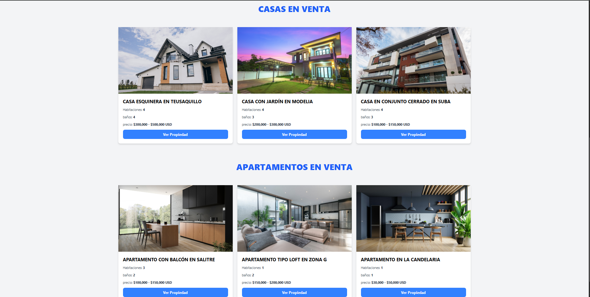
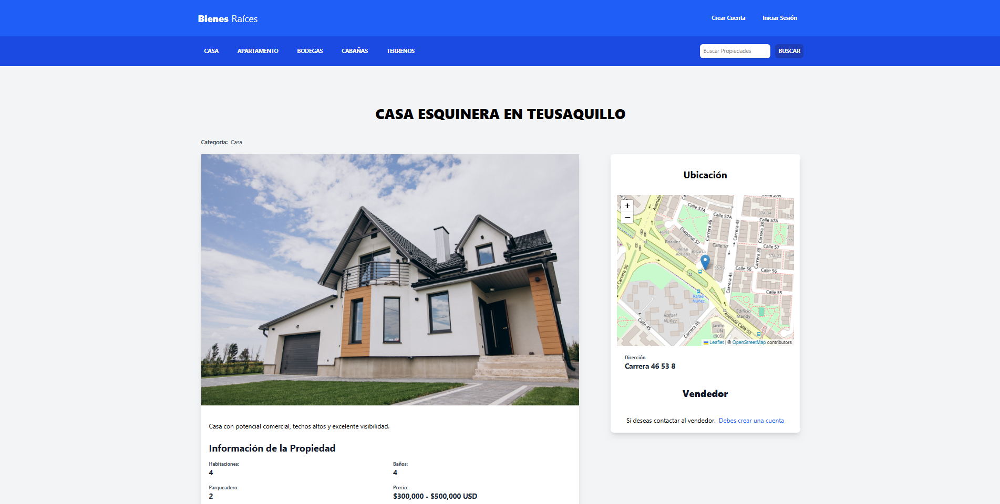
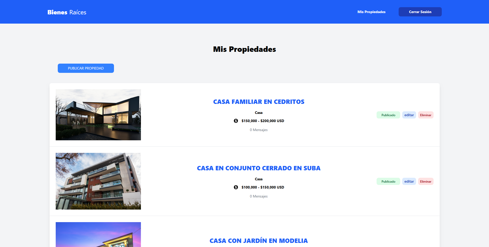

# 🏡 Bienes Raíces

La aplicación permite a los usuarios publicar propiedades para **vender o arrendar**, visualizar información detallada de cada inmueble, y enviar **mensajes directos a los vendedores** interesados. También incluye una interfaz administrativa para gestionar propiedades, mensajes de forma eficiente.

---

## 🚀 Tecnologías utilizadas

- **Node.js** + **Express**
- **Sequelize** + **MySQL**
- **Pug** (motor de plantillas)
- **Tailwind CSS**
- **JWT** (autenticación con tokens)
- **CSRF Protection**
- **Dropzone** (subida de imágenes)
- **Multer** (procesamiento de archivos)
- **Leaflet.js** (mapa interactivo)
- **dotenv** (configuración por entorno)

---

## ⚙️ Funcionalidades principales

- Registro y autenticación de usuarios (con JWT y cookies seguras)
- Creación, edición y eliminación de propiedades
- Subida de imágenes con vista previa (Dropzone + Multer)
- Vista pública de propiedades publicadas con diseño responsivo
- Filtro dinámico por **categoría** y **precio**
- Mapa interactivo para mostrar ubicación de propiedades
- Mensajes a los vendedores desde la página pública
- Panel administrativo para gestionar propiedades y mensajes
- Sistema de paginación y búsqueda
- Validaciones del lado del cliente y del servidor
- Distinción de plantillas públicas y administrativas

---

## 🧪 Usuarios de prueba

Puedes iniciar sesión con estos usuarios predefinidos:

- 📧 **prueba@gmail.com**  
  🔑 **Prueba123**

- 📧 **correo@gmail.com**  
  🔑 **Prueba123**

---

## 📦 Instalación local

1. Clona el repositorio:

   ```bash
   git clone https://github.com/tu-usuario/bienes-raices.git
   cd bienes-raices

2. npm install

3. Crea un archivo .env
   - DB_HOST=localhost
   - DB_USER=tu_usuario
   - DB_PASSWORD=tu_contraseña
   - DB_NAME=bienes_raices
   - DB_PORT=3306
   - JWT_SECRET=un_secreto_seguro
   - EMAIL_HOST=smtp.tucorreo.com
   - EMAIL_PORT=587
   - EMAIL_USER=correo@tucorreo.com
   - EMAIL_PASS=contraseña

4. Ejecuta los seeders para generar datos de prueba (usuarios, propiedades, categorías, etc.)

5. Inicia el servidor: npm run dev

6. Visita la app en: http://localhost:3000

## 👤 Autor
Desarrollado por Miguel.

## 🖼️ Capturas de pantalla

### Página principal


### Sección de casas y apartamentos


### Vista de una propiedad


### Panel administrativo
