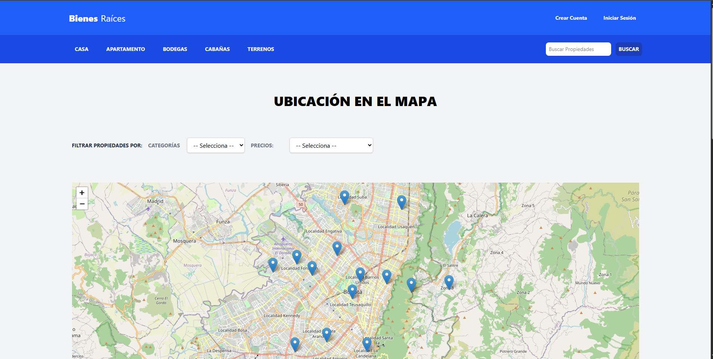

# 🏡 Bienes Raíces

La aplicación permite a los usuarios publicar propiedades para **vender o arrendar**, visualizar información detallada de cada inmueble, y enviar **mensajes directos a los vendedores** interesados. También incluye una interfaz administrativa para gestionar propiedades, mensajes de forma eficiente.

---

## 🚀 Tecnologías utilizadas

- **Node.js** + **Express**
- **Sequelize** + **MySQL**
- **Pug** (motor de plantillas)
- **Tailwind CSS**
- **JWT** (autenticación con tokens)
- **CSRF Protection**
- **Dropzone** (subida de imágenes)
- **Multer** (procesamiento de archivos)
- **Leaflet.js** (mapa interactivo)
- **dotenv** (configuración por entorno)

---

## ⚙️ Funcionalidades principales

- Registro y autenticación de usuarios (con JWT y cookies seguras)
- Creación, edición y eliminación de propiedades
- Subida de imágenes con vista previa (Dropzone + Multer)
- Vista pública de propiedades publicadas con diseño responsivo
- Filtro dinámico por **categoría** y **precio**
- Mapa interactivo para mostrar ubicación de propiedades
- Mensajes a los vendedores desde la página pública
- Panel administrativo para gestionar propiedades y mensajes
- Sistema de paginación y búsqueda
- Validaciones del lado del cliente y del servidor
- Distinción de plantillas públicas y administrativas

---

## 🧪 Usuarios de prueba

Puedes iniciar sesión con estos usuarios predefinidos:

- 📧 **prueba@gmail.com**  
  🔑 **Prueba123**

- 📧 **correo@gmail.com**  
  🔑 **Prueba123**

> *Credenciales solo para fines de prueba*

---

## 📦 Instalación local

1. Clona el repositorio:

   ```bash
   git clone https://github.com/tu-usuario/bienes-raices.git
   cd bienes-raices

2. npm install

3. Crea un archivo .env
   - DB_HOST=localhost
   - DB_USER=tu_usuario
   - DB_PASSWORD=tu_contraseña
   - DB_NAME=bienes_raices
   - DB_PORT=3306
   - JWT_SECRET=un_secreto_seguro
   - EMAIL_HOST=smtp.tucorreo.com
   - EMAIL_PORT=587
   - EMAIL_USER=correo@tucorreo.com
   - EMAIL_PASS=contraseña

4. Ejecuta los seeders para generar datos de prueba (usuarios, propiedades, categorías, etc.)

5. Inicia el servidor: npm run dev

6. Visita la app en: http://localhost:3000

## 👤 Autor
Desarrollado por Miguel.

## 🖼️ Capturas de pantalla

### Página principal


### Sección de casas y apartamentos


### Vista de una propiedad


### Panel administrativo


## 🔌 Endpoints de la API

### 📍 Propiedades

| Método | Ruta                   | Descripción                          |
|--------|------------------------|--------------------------------------|
| GET    | /api/propiedades       | Obtiene todas las propiedades        |
| GET    | /api/propiedades/:id   | Detalles de una propiedad            |
| POST   | /api/propiedades       | Crea una nueva propiedad             |

### 📨 Mensajes

| Método | Ruta                        | Descripción                        |
|--------|-----------------------------|------------------------------------|
| POST   | /api/mensajes               | Enviar un mensaje al propietario   |
| GET    | /api/mensajes/:propiedadId  | Ver mensajes de una propiedad      |


### 🔐 Autenticación (`/auth`)

| Método | Ruta                            | Descripción                                            |
|--------|----------------------------------|--------------------------------------------------------|
| GET    | /auth/login                      | Muestra el formulario de inicio de sesión             |
| POST   | /auth/login                      | Procesa los datos del login                           |
| GET    | /auth/register                   | Muestra el formulario de registro                     |
| POST   | /auth/register                   | Procesa el registro de un nuevo usuario               |
| GET    | /auth/recover-password           | Muestra el formulario para solicitar restablecer contraseña |
| POST   | /auth/recover-password           | Envía email para restablecer contraseña               |
| GET    | /auth/confirm-account/:token     | Confirma la cuenta del usuario mediante el token      |
| GET    | /auth/recover-password/:token    | Verifica el token de recuperación de contraseña       |
| POST   | /auth/recover-password/:token    | Almacena la nueva contraseña                          |
| POST   | /auth/logout                     | Cierra la sesión del usuario 

### 🏠 Sitio público (`/`)

| Método | Ruta                      | Descripción                                       |
|--------|---------------------------|---------------------------------------------------|
| GET    | /                         | Página de inicio con propiedades destacadas      |
| GET    | /category/:category       | Lista de propiedades filtradas por categoría     |
| GET    | /404                      | Página de error personalizada                    |
| POST   | /search                   | Buscador de propiedades por palabra clave        |

### 🌐 API pública (`/properties`)

| Método | Ruta            | Descripción                                      |
|--------|------------------|--------------------------------------------------|
| GET    | /properties      | Devuelve propiedades en formato JSON para el frontend (Pin de la úbicación)


### 🏘️ Propiedades (`/`)

#### 🔒 Área Privada (requiere autenticación)

| Método | Ruta                               | Descripción                                         |
|--------|------------------------------------|-----------------------------------------------------|
| GET    | /my-properties                     | Lista de propiedades del usuario                    |
| GET    | /properties/new-property           | Formulario para crear una nueva propiedad           |
| POST   | /properties/new-property           | Guarda nueva propiedad en la base de datos          |
| GET    | /properties/add-image/:code        | Formulario para subir imagen a una propiedad        |
| POST   | /properties/add-image/:code        | Guarda imagen subida con multer                     |
| GET    | /properties/edit/:code             | Formulario para editar una propiedad existente      |
| POST   | /properties/edit/:code             | Actualiza datos de una propiedad                    |
| POST   | /properties/delete/:code           | Elimina una propiedad                               |
| PUT    | /property/:code                    | Cambia el estado de la propiedad (activa/inactiva)  |
| GET    | /message/:code                     | Muestra los mensajes asociados a una propiedad      |

#### 🌐 Área Pública

| Método | Ruta                               | Descripción                                         |
|--------|------------------------------------|-----------------------------------------------------|
| GET    | /property/:code                    | Muestra la vista pública de una propiedad           |
| POST   | /property/:code                    | Enviar mensaje al propietario de la propiedad       |